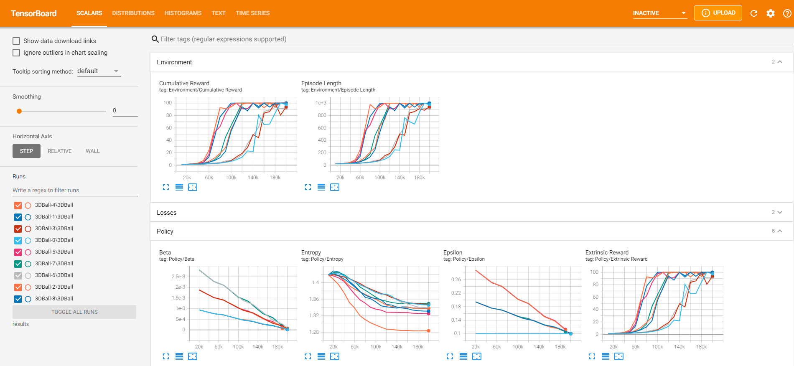
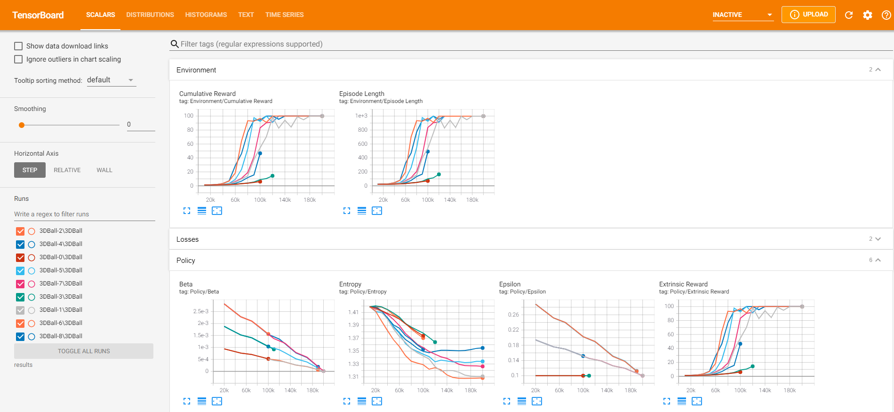

## Automated Hyperparameter Search for Unity ML-Agents

This is a batch runner for [Unity ML-Agents](https://github.com/Unity-Technologies/ml-agents/) training processes. It is supposed to automate hyperparameter grid searches.

### Config File
Modify your trainer config file by adding `opt_values` and `opt_stop` yaml parameters.

`opt_values` lists **parameter value options**, for example
<pre>
behaviors:
  3DBall:
    trainer_type: ppo
    hyperparameters:
      batch_size: 64
      buffer_size: 12000
      learning_rate: 0.0003
      <b>beta:
        opt_values: [0.001, 0.002, 0.003]
      epsilon:
        opt_values: [0.1, 0.2, 0.3]</b>
      lambd: 0.99
      num_epoch: 3
      learning_rate_schedule: linear
    network_settings:
      normalize: true
      hidden_units: 128
      num_layers: 2
      vis_encode_type: simple
    reward_signals:
      extrinsic:
        gamma: 0.99
        strength: 1.0
    keep_checkpoints: 5
    max_steps: 500000
    time_horizon: 1000
    summary_freq: 12000

</pre>
Here, only numerical values are defined, but `opt_values` works with all value types.
`mlagents-learn.py` will generate training runs for all possible combinations of the specified values. In this case 3 x 3 = 9 runs.  

  

The python script saves a `config_info.txt` file, listing individual value combinations associated with run IDs. The run IDs are suffixed with sequential numbers, here's the `config_info.txt` for above example:
<pre>
3DBall-0
- 3DBall
  - beta: 0.001
  - epsilon: 0.1

3DBall-1
- 3DBall
  - beta: 0.001
  - epsilon: 0.2

3DBall-2
- 3DBall
  - beta: 0.001
  - epsilon: 0.3

3DBall-3
- 3DBall
  - beta: 0.002
  - epsilon: 0.1

3DBall-4
- 3DBall
  - beta: 0.002
  - epsilon: 0.2

3DBall-5
- 3DBall
  - beta: 0.002
  - epsilon: 0.3

3DBall-6
- 3DBall
  - beta: 0.003
  - epsilon: 0.1

3DBall-7
- 3DBall
  - beta: 0.003
  - epsilon: 0.2

3DBall-8
- 3DBall
  - beta: 0.003
  - epsilon: 0.3
</pre>

Note that setting `opt_values` for multiple behaviors will increase the number of runs exponentially, because every behavior permutation will be combined with every other behavior permutation.
<pre> 
default_settings:
  hyperparameters:
    <b>beta:
        opt_values: [0.001, 0.002, 0.003]
    epsilon:
        opt_values: [0.1, 0.2, 0.3]</b>

behaviors:
  Goalie:
    trainer_type: poca
    hyperparameters:
    ...
  Striker:
    trainer_type: poca
    hyperparameters:
    ...
</pre>
In the above example, `opt_values` is set in `default_settings` which means the value permutations will be applied to both behaviors individually. The resulting run count would therefore be (3 x 3) x (3 x 3) = 81.

You can define **optional stop conditions** with the `opt_stop` parameter:
<pre> 
behaviors:
  3DBall:
    trainer_type: ppo
    hyperparameters:
      ...
    <b>opt_stop:
      tag: Environment/Cumulative Reward
      step: 100000
      min: 50</b>
</pre>
Stop conditions require TensorBoard to be running at `http://localhost:6006/` The python script queries TensorBoard's HTTP API once a minute and checks if the active runs' latest scalar values satisfy the stop conditions.
* `tag` TensorBoard tag, for instance `Environment/Cumulative Reward`
* `step` When to start checking values, defaults to 0
* `min` The condition will evaluate true if the latest value is below min, defaults to -999999999
* `max` The condition will evaluate true if the latest value is above max, defaults to +999999999  

  

In the above example, we start checking if cumulative rewards are above 50 after 100k steps. Runs that don't make the cut are being stopped prematurely.

### Start Training

Launch your training runs by calling `python mlagents-learn.py` with all the command line arguments you would normally pass to `mlagents-learn`. Assuming that you train with executable environments, you should specify the `--num-envs` argument for the number of concurrent training runs (defaults to 1). The script will open corresponding python consoles for `mlagents-learn` subprocesses, watch their progress and log start/stop events for the individual runs.

Please note that I could only test this on Windows yet. Stopping a training run prematurely on Unix *should* shut down the subprocess gracefully. However on Windows, processes will be terminated immediately, which means they won't save their latest models. ML-Agents' [trainer_controller](https://github.com/Unity-Technologies/ml-agents/blob/main/ml-agents/mlagents/trainers/trainer_controller.py) stops training in case of a `Ctrl-C` input. But as far as I understand it, sending a `Ctrl-C` to a subprocess is not as straight-forward on Windows. It looks like sending a `CTRL_BREAK_EVENT` signal is the preferred workaround, but that would require `trainer_controller` to handle the signal, which it doesn't. I don't consider this to be such a big issue though, because I'm guessing that stop conditions would typically be used for filtering out badly performing runs.
