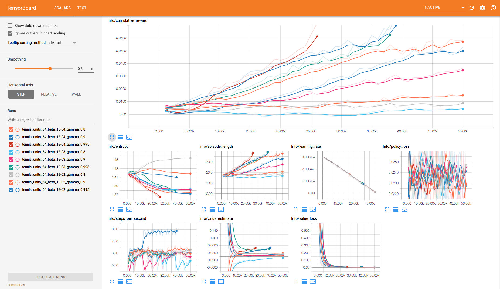

## Hyperparameter Tuning for Unity ML-Agents v0.4

A batch runner for [Unity ML-Agents](https://github.com/Unity-Technologies/ml-agents) trainers. 

### How to use
Implement your optimization algorithm in [/python/hyper_tuner.py](https://github.com/mbaske/ml-agents-hyperparams/blob/master/python/hyper_tuner.py). Run tune.py instead of learn.py with the following options:
							 
    --curriculum=<file>        Curriculum json file for environment [default: None].
    --keep-checkpoints=<n>     How many model checkpoints to keep [default: 5].
    --lesson=<n>               Start learning from this lesson [default: 0].
    --load                     Whether to load the model or randomly initialize [default: False].
    --run-id=<path>            The sub-directory name for model and summary statistics [default: ppo].
    --save-freq=<n>            Frequency at which to save model [default: 50000].
    --seed=<n>                 Random seed used for training [default: -1].
    --slow                     Whether to run the game at training speed [default: False].
    --docker-target-name=<dt>  Docker Volume to store curriculum, executable and model files [default: Empty].
    --no-graphics              Whether to run the Unity simulator in no-graphics mode [default: False].
    
    --workers=<n>              Number of subprocesses / concurrent trainers [default: 0].
    --config=<path>            The sub-directory name for config json files [default: config].
                
Trainers launch as subprocesses, in editor training is not supported. The default number of processes matches the amount of CPU cores if `--workers` wasn't specified. Hyperparameters still get loaded from trainer_config.yaml, but will be complemented or overridden by the ones defined in your code.

Tested with ml-agents v0.4 on macOS (Python 3.6).

### Example
This is a simple grid search demo using the tennis environment from ml-agents examples. Training data is created beforehand and then served incrementally to the trainers.

	def grid_demo(self):
        stop = [StopCondition('episode_length', '> 40')]
        beta = [1e-4, 1e-3, 1e-2]
        gamma = [0.8, 0.9, 0.995]
        hidden_units = int(math.pow(2, 6 + self.num_batch))

        for b in beta:
            for g in gamma:
                hyper = {'beta': b, 'gamma': g, 'hidden_units': hidden_units}
                descr = '_units_{0}_beta_{1}_gamma_{2}'.format(hidden_units, '%.0E' % Decimal(b), g)
                self.trainer_data.append(TrainerData(descr, hyper, stop))
                
        self.run_trainer_batch()
                
Run trainers and compare their performance in TensorBoard.

	python3 tune.py tennis --run-id=tennis
	tensorboard --logdir=summaries

